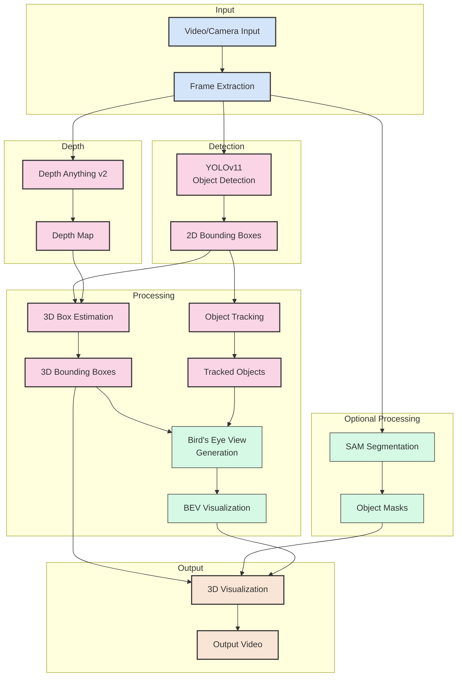
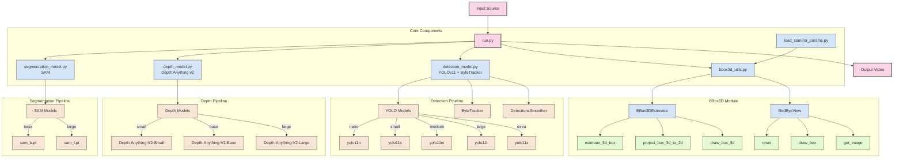
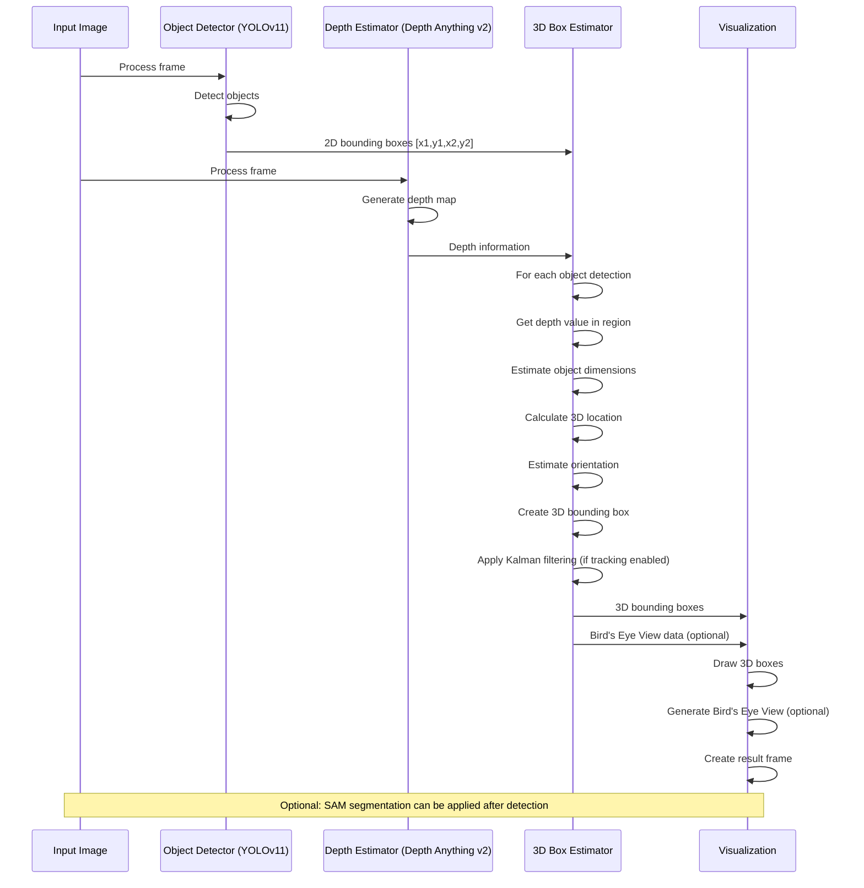

# YOLO-3D

<div align="center">
  <p>
    <a href="https://github.com/farshidrayhancv/Yolo_depth3D" target="_blank">
      </a>
  </p>

  <a href="https://www.python.org/downloads/">=3.8-blue.svg"></a>
  <a href="https://pytorch.org/get-started/locally/">=2.0-orange.svg"></a>
  <a href="https://github.com/farshidrayhancv/Yolo_depth3D/blob/main/LICENSE"></a>
</div>

## Overview

YOLO-3D is a cutting-edge real-time 3D object detection system that integrates YOLOv11 for object detection with Depth Anything v2 for depth estimation. The system creates pseudo-3D bounding boxes and bird's eye view visualizations that provide enhanced spatial understanding in various environments.

**Key Features:**

- Real-time object detection using YOLOv11 with multiple model sizes
- Advanced depth estimation with Depth Anything v2
- Immersive 3D bounding box visualization
- Bird's Eye View (BEV) for enhanced spatial understanding
- Object tracking for consistent identification
- Segmentation with Segment Anything Model (SAM)
- Support for video files and webcam input
- Adjustable model sizes for performance/accuracy tradeoffs

## Architecture and Pipeline



## Detailed Architecture



## 3D Box Estimation Process



## Installation

1. Clone the repository:
```bash
git clone https://github.com/farshidrayhancv/Yolo_depth3D.git
cd YOLO-3D
```

2. Install dependencies:
```bash
pip install -r requirements.txt
```

3. Create a config file:
```bash
cp config.yaml.example config.yaml
```

## Usage

### Basic Usage

Run with default settings:
```bash
python run.py
```

### Command Line Options

```bash
python run.py --source /path/to/video.mp4 --output results.mp4
```

#### Options
- `--source`: Path to input video file or webcam index (0 for default camera)
- `--output`: Path to output video file
- `--skip-frames`: Skip N frames between processing (0 to process all frames)
- `--no-sam`: Disable SAM segmentation
- `--config`: Path to configuration file

### Configuration

Edit `config.yaml` to customize:

```yaml
# Model configuration
models:
  yolo_size: "nano"  # nano, small, medium, large, extra
  depth_size: "small"  # small, base, large
  sam_size: "base"  # base, large

# Device settings
device: "cuda"  # cuda, cpu, mps

# Feature toggles
features:
  tracking: true
  bev: true
  pseudo_3d: true
  sam: true
```

## How It Works

```python
import cv2
from detection_model import ObjectDetector
from depth_model import DepthEstimator
from bbox3d_utils import BBox3DEstimator, BirdEyeView

# Initialize models
detector = ObjectDetector(model_size="small", device="cuda")
depth_estimator = DepthEstimator(model_size="small", device="cuda")
bbox3d_estimator = BBox3DEstimator()
bev = BirdEyeView(scale=60, size=(300, 300))

# Open video source
cap = cv2.VideoCapture(0)  # Use camera

while True:
    # Read frame
    ret, frame = cap.read()
    if not ret:
        break
    
    # Step 1: Object Detection
    detection_frame, detections = detector.detect(frame.copy(), track=True)
    
    # Step 2: Depth Estimation
    depth_map = depth_estimator.estimate_depth(frame)
    
    # Step 3: 3D Bounding Box Estimation
    boxes_3d = []
    active_ids = []
    for detection in detections:
        bbox, score, class_id, obj_id = detection
        
        # Get class name
        class_name = detector.get_class_names()[class_id]
        
        # Get depth in the region of the bounding box
        depth_value = depth_estimator.get_depth_in_region(depth_map, bbox, method='median')
        
        # Create 3D box
        box_3d = {
            'bbox_2d': bbox,
            'depth_value': depth_value,
            'class_name': class_name,
            'object_id': obj_id,
            'score': score
        }
        boxes_3d.append(box_3d)
        
        if obj_id is not None:
            active_ids.append(obj_id)
    
    # Clean up trackers for objects no longer in frame
    bbox3d_estimator.cleanup_trackers(active_ids)
    
    # Step 4: Visualization
    result_frame = frame.copy()
    for box_3d in boxes_3d:
        result_frame = bbox3d_estimator.draw_box_3d(result_frame, box_3d)
    
    # Generate Bird's Eye View
    bev.reset()
    for box_3d in boxes_3d:
        bev.draw_box(box_3d)
    bev_image = bev.get_image()
    
    # Add BEV to corner of result frame
    bev_height = result_frame.shape[0] // 4
    bev_width = bev_height
    bev_resized = cv2.resize(bev_image, (bev_width, bev_height))
    result_frame[result_frame.shape[0] - bev_height:, 0:bev_width] = bev_resized
    
    # Display result
    cv2.imshow("YOLO-3D", result_frame)
    if cv2.waitKey(1) & 0xFF == ord('q'):
        break

# Clean up
cap.release()
cv2.destroyAllWindows()
```

YOLO-3D works by combining state-of-the-art models and techniques to create a comprehensive 3D understanding from 2D video inputs:

1. **Object Detection**: YOLOv11 detects objects in the frame and provides 2D bounding boxes
2. **Depth Estimation**: Depth Anything v2 generates a depth map for the entire frame
3. **3D Box Estimation**: Combines 2D boxes with depth information to create 3D boxes
4. **Tracking**: ByteTracker with Kalman filtering ensures consistent object identification
5. **Segmentation**: SAM provides detailed object masks for better visualization
6. **Bird's Eye View**: Converts 3D information into a top-down visualization

### Models and Performance

YOLO-3D offers multiple model sizes for each component, allowing you to balance performance and accuracy:

#### YOLOv11 Models

| Model | Size | Speed | mAP | Use Case |
|-------|------|-------|-----|----------|
| YOLOv11n | 3.5 MB | 1.21 ms | 37.3% | Mobile devices, edge computing |
| YOLOv11s | 13.6 MB | 1.81 ms | 44.9% | Embedded systems |
| YOLOv11m | 41.3 MB | 3.40 ms | 50.5% | Standard desktop/GPU |
| YOLOv11l | 89.0 MB | 5.61 ms | 52.9% | High-performance systems |
| YOLOv11x | 107 MB | 7.80 ms | 54.2% | Server deployment |

#### Depth Anything v2 Models

| Model | Size | Speed | Performance | Use Case |
|-------|------|-------|-------------|----------|
| Small | 29 MB | 18 ms | Good | Mobile, edge deployment |
| Base | 124 MB | 28 ms | Better | Standard desktop/GPU |
| Large | 343 MB | 42 ms | Best | High-performance systems |

## Project Structure

```
YOLO-3D/
│── run.py                  # Main script
│── detection_model.py      # YOLOv11 object detection
│── depth_model.py          # Depth Anything v2 depth estimation
│── bbox3d_utils.py         # 3D bounding box utilities
│── segmentation_model.py   # SAM segmentation 
│── load_camera_params.py   # Camera parameter utilities
├── requirements.txt        # Project dependencies
└── README.md               # This file
```

## Examples

### 3D Bounding Box Visualization

YOLO-3D creates pseudo-3D bounding boxes with depth information:

- Boxes are sized according to detected object dimensions
- Depth is indicated by box perspective and color intensity
- Consistent tracking IDs are maintained across frames
- Class labels and confidence scores are displayed

### Bird's Eye View

The Bird's Eye View visualization provides a top-down perspective:

- Visualizes relative positions of objects
- Shows distance from camera
- Provides spatial relationships between objects
- Assists in understanding scene layout

## Customization

### Camera Parameters

For optimal 3D estimation, you can provide custom camera parameters:

```bash
# First, create a camera parameters file
python calibrate_camera.py --images /path/to/calibration/images

# Then run with the parameters file
python run.py --config config.yaml
```

Edit your `config.yaml` to include:
```yaml
camera:
  params_file: "camera_params.json"
```

### Object Dimensions

Default object dimensions can be customized in `bbox3d_utils.py` to match your specific use case.

## Requirements

- Python 3.8+
- PyTorch 2.0+
- OpenCV
- NumPy
- Ultralytics 8.0+
- Transformers 4.30+
- Supervision 0.23+ (for tracking)
- Other dependencies listed in `requirements.txt`

## Acknowledgments

- YOLOv11 by Ultralytics
- Depth Anything v2 by Microsoft
- SAM (Segment Anything Model) by Meta AI
- ByteTracker for object tracking

## License

This project is released under the MIT License.

## Citation

```bibtex
@software{yolo3d,
  author = {Farshid Rayhan},
  title = {YOLO-3D: Real-time 3D Object Detection with Depth Estimation},
  url = {https://github.com/farshidrayhancv/Yolo_depth3D},
  year = {2025},
}
```

## Reference 

1. [GitHub repository](https://github.com/niconielsen32/YOLO-3D).
